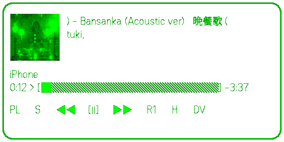

# GlassesView Guide

GlassesView shows the current track, playback progress, and a scrollable control row. Complete Spotify authorization and detailed settings in the [phone WebView](./webview.md) first.



This image is an actual Glasses Display render from the Even Hub simulator, not a photo of physical glasses.

## Before you start

1. The phone WebView must show **Connected**.
2. Spotify must have at least one online playback device.
3. Start a track and confirm that the phone shows its title and progress.
4. Open Even Hub Spotify Console on the glasses.

## Gestures

| Gesture | Result |
| --- | --- |
| Scroll left or right | When visible, move the highlighted control; the direction reverses when inverted scrolling is enabled. When hidden, the first scroll only restores the display and returns |
| Single click | When visible, run the highlighted action. When hidden, the first click only restores the display and returns |
| Double click | Open the Even system exit confirmation; do not hide or restore GlassesView |

Returning the app to the foreground does not force a hidden view to appear. If the display is blank, click or scroll once in either direction to restore it; that wake gesture does not play, skip, select a list item, transfer playback, or move focus. Double-click while hidden still opens the system exit confirmation.

## Playback controls

The default order is:

```text
PL → S/S+ → previous → play/pause → next → repeat → H → DV
```

- `PL`: open playlists.
- `S` / `S+`: shuffle off/on.
- Previous, play/pause, next: control the active Spotify device.
- Repeat: cycle through off, repeat one, and repeat all.
- `H`: hide GlassesView. It is not exit, does not call `shutDownPageContainer()`, and does not send a Spotify API request.
- `DV`: open Spotify devices and transfer playback.

After a click, wait for the state to refresh before issuing another action. Progress advances locally once per second and periodically resynchronizes with Spotify, so a small temporary difference is normal.

## Playlists

1. Scroll to `PL` and single-click.
2. The first list item returns to Now Playing.
3. Scroll to **Liked Songs** or a playlist configured on the phone.
4. Single-click to start it and return to the main view.

**Liked Songs** currently starts in shuffle mode. The available list is controlled by the phone WebView playlist slots.

## Transfer playback

1. Scroll to `DV` and single-click.
2. The first list item returns to Now Playing.
3. Select an online Spotify device and single-click.
4. Wait for the transfer to complete.

If the list is empty, start a track in the official Spotify phone or desktop client, then refresh the phone WebView connection.

## Display and auto-hide

The phone WebView controls these glasses settings:

- Progress style, border, and text layout.
- Album-art size and opacity.
- Control icons and horizontal scroll direction.
- Auto-hide enablement and delay.

The view hides after inactivity only when auto-hide is enabled. Auto-hide and manual `H` hide use the same recovery: the first click or scroll in either direction only restores the display and returns. Double-click does not restore the display; it opens the Even system exit confirmation.

## Common problems

- **Display works but controls do not**: use Remote mode and a Premium account.
- **Progress does not update**: check the phone connection, self-host service, and Tailscale.
- **Selection moves the wrong way**: toggle inverted scrolling.
- **The display disappeared**: auto-hide may have triggered; click or scroll once in either direction. The wake gesture does not run the current control.
- **You want to exit the app**: double-click and choose in the Even system confirmation; `H` only hides the display.
- **Track or device list is empty**: create an active playback device in the official Spotify client first.

For authorization and network problems, use [troubleshooting](./troubleshooting.md).
