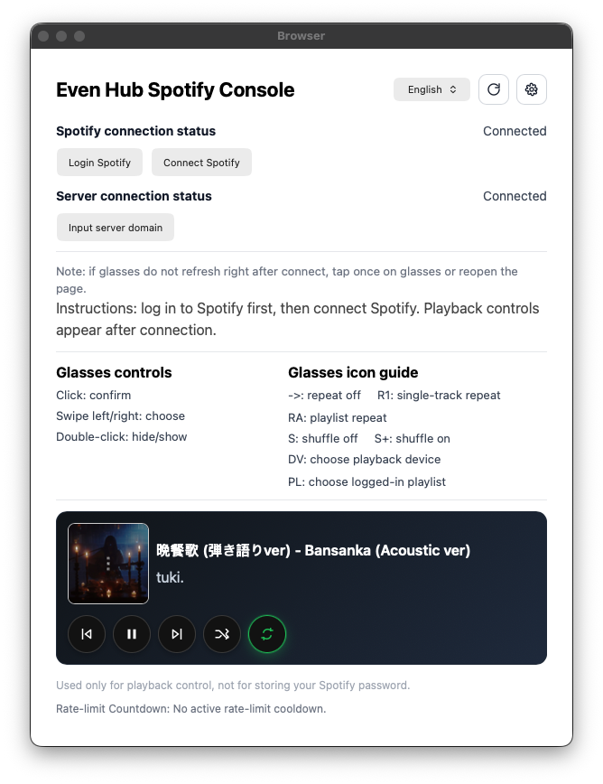
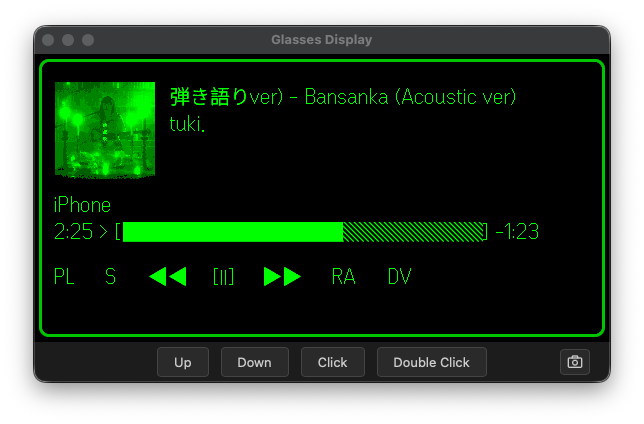

# Local Simulator Guide

Related pages: [Home](./README.md) | [Spotify Developer Dashboard Setup](./spotify-dashboard.md) | [Real Device Self-Host Guide](./device.md) | [Usage Guide](./usage.md) | [Configuration Guide](./configuration.md) | [Troubleshooting Guide](./troubleshooting.md)

This page only covers the local simulator / browser debugging path.

## Scope

Use this path when:

- you are debugging in a local browser or EvenHub simulator
- you do not start the self-host server
- you do not need Tailscale, Docker, or Raspberry Pi
- Spotify callback returns to the frontend page `/callback.html`

For real phone and glasses usage, see [Real Device Self-Host Guide](./device.md).

## Related Docs

Shared setup:

- [Spotify Developer Dashboard Setup](./spotify-dashboard.md)
- [Configuration Guide](./configuration.md)
- [Troubleshooting Guide](./troubleshooting.md)

The simulator path does not require:

- [Tailscale HTTPS Guide](./tailscale.md)
- [Docker Guide](./docker.md)
- [Raspberry Pi Guide](./raspberry-pi.md)

## Quick Start

1. Create `simulator.config.json` in the project root and fill in `spotifyClientId` and `localPort`.

```json
{
  "spotifyClientId": "your_spotify_client_id",
  "localPort": 5173
}
```

2. Run this in one terminal:

```bash
cd app
npm run dev:simulator
```

3. Start EvenHub simulator in another terminal:

```text
evenhub-simulator "http://127.0.0.1:<Port>/?simulator=true"
```

`<Port>` must match `localPort` in `simulator.config.json`. The default is `5173`.

4. In the phone page opened by simulator, click `Login Spotify`. After Spotify login succeeds, press `Backspace` to return to the main page.
5. Click `Connect Spotify`. When `Allow Spotify to connect` appears, click `Agree` at the bottom of the page. After `Success` appears, the app returns automatically.
6. If the glasses window does not refresh, click the refresh button at the top right of the phone page.

Connection reference:

Phone page connected state:



Glasses authorization state:



This script sets:

```text
VITE_SPOTIFY_AUTH_MODE=client
```

## Spotify Redirect URI

Add this in Spotify Developer Dashboard:

```text
http://127.0.0.1:5173/callback.html
```

If you switch to `5174`:

```text
http://127.0.0.1:5174/callback.html
```

For the full form fields, see [Spotify Developer Dashboard Setup](./spotify-dashboard.md).

## Runtime Settings

In page `Settings`:

1. Enter your Spotify `Client ID`
2. Keep `Service Origin` as the current page origin
3. Click `Save Config`
4. Confirm `Effective Redirect URI` is `http://127.0.0.1:5173/callback.html`
5. Click `Connect Spotify`

After connecting, see [Usage Guide](./usage.md) for phone and glasses controls.

## Verification

After connecting:

- the browser console should not navigate to `/api/auth/start`
- Spotify callback should return to `/callback.html`
- `Effective Redirect URI` in `Settings` should end with `/callback.html`

If Spotify shows an error, first check whether the Redirect URI exactly matches [Spotify Developer Dashboard Setup](./spotify-dashboard.md).
