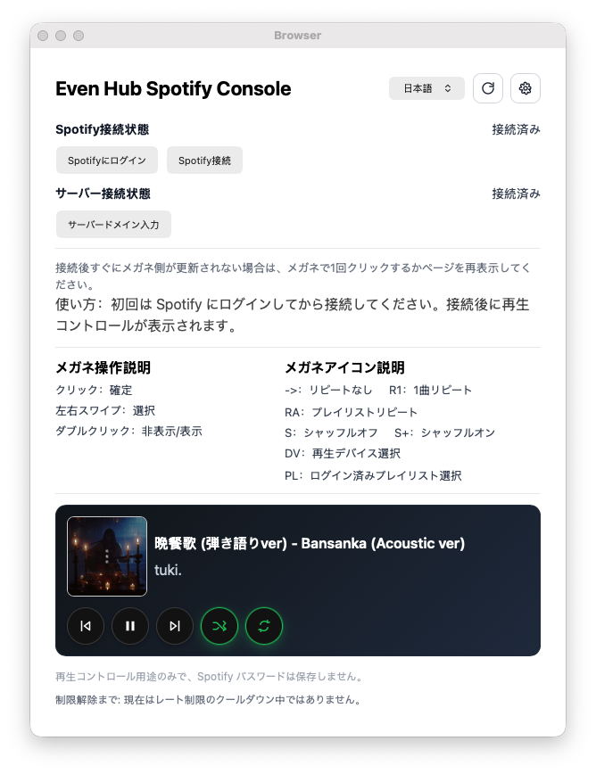
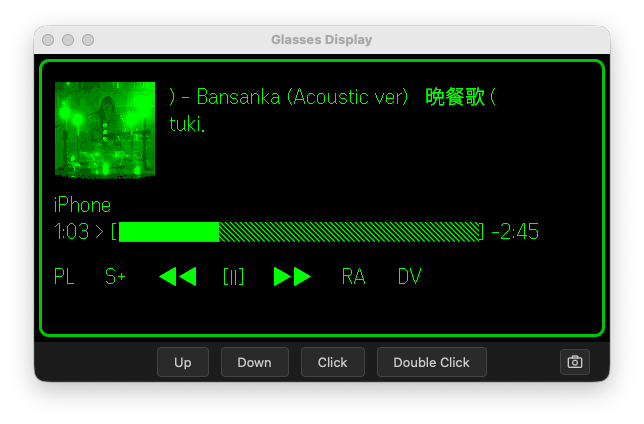

# Local Simulator ガイド

関連ページ：[ホーム](./README.md) | [Spotify Developer Dashboard 設定](./spotify-dashboard.md) | [Real Device Self-Host ガイド](./device.md) | [使用ガイド](./usage.md) | [設定ガイド](./configuration.md) | [Troubleshooting ガイド](./troubleshooting.md)

このページは local simulator / browser debug path のみを扱います。

## 適用範囲

この path を使う場面：

- local browser または EvenHub simulator で debug する
- self-host server を起動しない
- Tailscale、Docker、Raspberry Pi は不要
- Spotify callback は frontend page `/callback.html` に戻る

実機 phone と glasses で使う場合は [Real Device Self-Host ガイド](./device.md) を見てください。

## 関連ドキュメント

共通設定：

- [Spotify Developer Dashboard 設定](./spotify-dashboard.md)
- [設定ガイド](./configuration.md)
- [Troubleshooting ガイド](./troubleshooting.md)

simulator path では不要：

- [Tailscale HTTPS ガイド](./tailscale.md)
- [Docker ガイド](./docker.md)
- [Raspberry Pi ガイド](./raspberry-pi.md)

## Quick Start

1. project root に `simulator.config.json` を作成し、`spotifyClientId` と `localPort` を入力します。

```json
{
  "spotifyClientId": "your_spotify_client_id",
  "localPort": 5173
}
```

2. 1 つ目の terminal で実行します。

```bash
cd app
npm run dev:simulator
```

3. もう 1 つの terminal で EvenHub simulator を起動します。

```text
evenhub-simulator "http://127.0.0.1:<Port>/?simulator=true"
```

`<Port>` は `simulator.config.json` の `localPort` と一致させます。デフォルトは `5173` です。

4. simulator が開いた phone page で `Spotifyにログイン` をクリックします。Spotify login が成功したら、`Backspace` で main page に戻ります。
5. `Spotify接続` をクリックします。`Allow Spotify to connect` が表示されたら、ページ最下部の `Agree` をクリックします。`Success` が表示された後、自動で戻ります。
6. glasses window が更新されない場合は、phone page 右上の refresh button をクリックします。

接続参考画像：

Phone page 接続状態：



Glasses 認可状態：



この script は次を設定します。

```text
VITE_SPOTIFY_AUTH_MODE=client
```

## Spotify Redirect URI

Spotify Developer Dashboard に追加：

```text
http://127.0.0.1:5173/callback.html
```

`5174` に変える場合：

```text
http://127.0.0.1:5174/callback.html
```

入力欄の詳細は [Spotify Developer Dashboard 設定](./spotify-dashboard.md) を見てください。

## Runtime Settings

ページの `Settings` で：

1. Spotify `Client ID` を入力する
2. `Service Origin` は現在の page origin のままにする
3. `Save Config` をクリックする
4. `Effective Redirect URI` が `http://127.0.0.1:5173/callback.html` であることを確認する
5. `Connect Spotify` をクリックする

接続後の phone と glasses の操作は [使用ガイド](./usage.md) を見てください。

## 検証

接続後：

- browser console は `/api/auth/start` に遷移しない
- Spotify callback は `/callback.html` に戻る
- `Settings` の `Effective Redirect URI` は `/callback.html` で終わる

Spotify が error を表示する場合は、まず [Spotify Developer Dashboard 設定](./spotify-dashboard.md) の Redirect URI と完全一致しているか確認してください。
