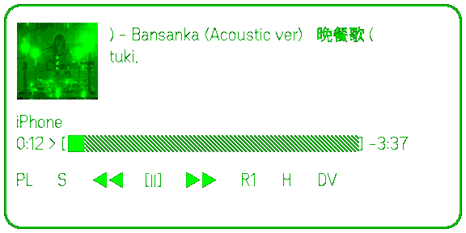

# 眼镜 GlassesView 使用说明

GlassesView 显示当前曲目、播放进度和可滚动的控制项。Spotify 授权与详细设置必须先在[手机 WebView](./webview.md)完成。



该图来自 Even Hub simulator 的 Glasses Display 实际渲染，不是实机眼镜照片。

## 开始前

1. 手机 WebView 的连接状态必须为“已连接”。
2. Spotify 中至少有一个在线播放设备。
3. 先播放一首歌，确认手机端能看到曲名和进度。
4. 打开眼镜上的 Even Hub Spotify Console。

## 基本手势

| 手势 | 结果 |
| --- | --- |
| 向左或向右滚动 | 显示时移动当前高亮控制项；开启“反转滚动”后方向相反。隐藏时第一次滚动只恢复显示并立即结束 |
| 单击 | 显示时执行高亮项。隐藏时第一次单击只恢复显示并立即结束 |
| 双击 | 打开 Even 系统退出确认；不隐藏或恢复 GlassesView |

从前台重新进入应用不会强制显示已隐藏的界面。若画面为空，单击或向任一方向滚动一次即可恢复；这次唤醒不会执行播放、切歌、选择列表、转移设备或移动焦点。隐藏状态下双击仍会打开系统退出确认。

## 播放控制项

默认顺序为：

```text
PL → S/S+ → 上一首 → 播放/暂停 → 下一首 → 循环 → H → DV
```

- `PL`：打开播放列表。
- `S` / `S+`：随机播放关闭/开启。
- 上一首、播放/暂停、下一首：控制当前 Spotify 播放设备。
- 循环：在关闭、单曲循环和全部循环之间切换，界面会显示对应状态。
- `H`：隐藏 GlassesView；它不是退出，不调用 `shutDownPageContainer()`，也不触发 Spotify API 请求。
- `DV`：打开 Spotify 设备列表并转移播放。

单击后等待状态刷新再进行下一次操作。进度条会在本地按秒推进，并定期与 Spotify 同步，因此短暂偏差属于正常现象。

## 播放列表

1. 滚动到 `PL` 并单击。
2. 列表第一项返回当前播放画面。
3. 继续滚动选择 “Liked Songs” 或手机设置页配置的播放列表。
4. 单击后开始播放所选列表并返回主画面。

“Liked Songs”当前以随机播放方式启动。可选列表由手机 WebView 的播放列表槽位决定。

## 切换播放设备

1. 滚动到 `DV` 并单击。
2. 列表第一项返回当前播放画面。
3. 选择一个在线 Spotify 设备并单击。
4. 等待播放转移完成。

若列表为空，先打开 Spotify 手机或桌面客户端并播放一首歌，然后在手机 WebView 刷新连接。

## 显示与自动隐藏

以下设置在手机 WebView 中修改，并同步到眼镜：

- 进度条样式、边框和文字布局。
- 专辑图大小和透明度。
- 控制图标和左右滚动方向。
- 自动隐藏开关与等待秒数。

只有启用自动隐藏后，界面才会在无操作时隐藏。自动隐藏与 `H` 手动隐藏使用相同的恢复方式：第一次单击或向任一方向滚动只恢复显示并立即结束。双击不负责恢复，而是打开 Even 系统退出确认。

## 常见问题

- **只有画面，没有控制响应**：确认使用 Remote 模式且账号为 Premium。
- **进度不更新**：确认手机 WebView 仍已连接，并检查 self-host 服务和 Tailscale。
- **按钮执行到错误方向**：关闭或开启“反转滚动”后重试。
- **画面突然消失**：可能触发自动隐藏；单击或向任一方向滚动一次恢复，第一次唤醒不会执行当前控制。
- **想退出应用**：双击并在 Even 系统确认框中选择；`H` 只隐藏显示。
- **曲目或设备列表为空**：先让 Spotify 官方客户端产生一个活动播放设备。

更完整的认证和网络问题见[故障排查](./troubleshooting.md)。
