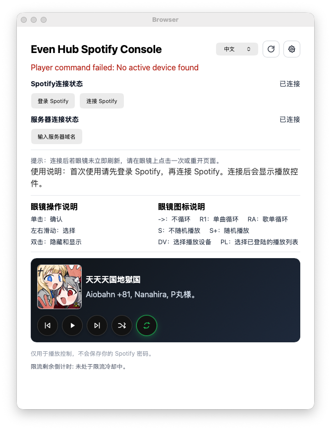
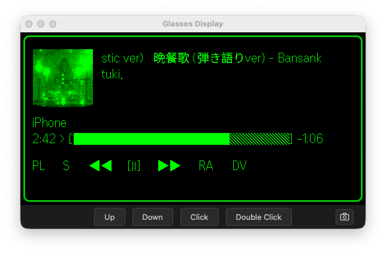

# 本机模拟器指南

相关页面：[项目首页](./README.md) | [Spotify Developer Dashboard 设置](./spotify-dashboard.md) | [实机 Self-Host 指南](./device.md) | [使用说明](./usage.md) | [配置指南](./configuration.md) | [Troubleshooting 指南](./troubleshooting.md)

本页只覆盖本机 simulator / browser 调试路径。

## 适用场景

使用本页路径时：

- 在本机浏览器或 EvenHub simulator 中调试
- 不启动 self-host server
- 不需要 Tailscale、Docker 或 Raspberry Pi
- Spotify callback 回到前端页面 `/callback.html`

如果要在真实手机和 glasses 上使用，请看 [实机 Self-Host 指南](./device.md)。

## 相关文档

共同设置：

- [Spotify Developer Dashboard 设置](./spotify-dashboard.md)
- [配置指南](./configuration.md)
- [Troubleshooting 指南](./troubleshooting.md)

模拟器路径不需要：

- [Tailscale HTTPS 指南](./tailscale.md)
- [Docker 指南](./docker.md)
- [Raspberry Pi 指南](./raspberry-pi.md)

## Quick Start

1. 在项目根目录创建 `simulator.config.json`，填入 `spotifyClientId` 和 `localPort`。

```json
{
  "spotifyClientId": "your_spotify_client_id",
  "localPort": 5173
}
```

2. 终端执行：

```bash
cd app
npm run dev:simulator
```

3. 另一个终端启动 EvenHub simulator：

```text
evenhub-simulator "http://127.0.0.1:<Port>/?simulator=true"
```

`<Port>` 必须和 `simulator.config.json` 中的 `localPort` 一致。默认是 `5173`。

4. 在 simulator 弹出的手机页面里点击 `登录 Spotify`。成功登录 Spotify 后，按 `Backspace` 返回主页面。
5. 点击 `连接 Spotify`。确认出现 `Allow Spotify to connect` 后，在页面最下面点击 `Agree`。出现 `Success` 后会自动返回。
6. 如果眼镜窗口没有刷新，点击手机页面右上角的刷新按键。

连接示意图：

手机页面连接状态：



Glasses 授权状态：



这个脚本会设置：

```text
VITE_SPOTIFY_AUTH_MODE=client
```

## Spotify Redirect URI

在 Spotify Developer Dashboard 中添加：

```text
http://127.0.0.1:5173/callback.html
```

如果你换成 `5174`：

```text
http://127.0.0.1:5174/callback.html
```

完整填写方式见 [Spotify Developer Dashboard 设置](./spotify-dashboard.md)。

## Runtime Settings

在页面 `Settings` 中：

1. 填入 Spotify `Client ID`
2. 保持 `Service Origin` 为当前页面 origin
3. 点击 `Save Config`
4. 确认 `Effective Redirect URI` 是 `http://127.0.0.1:5173/callback.html`
5. 点击 `Connect Spotify`

连接成功后，手机页面和 glasses 的操作说明见 [使用说明](./usage.md)。

## 验证

连接成功后：

- browser 控制台不应跳到 `/api/auth/start`
- Spotify callback 应回到 `/callback.html`
- `Settings` 中的 `Effective Redirect URI` 应以 `/callback.html` 结尾

如果 Spotify 显示错误，先检查 [Spotify Developer Dashboard 设置](./spotify-dashboard.md) 中的 Redirect URI 是否完全匹配。
